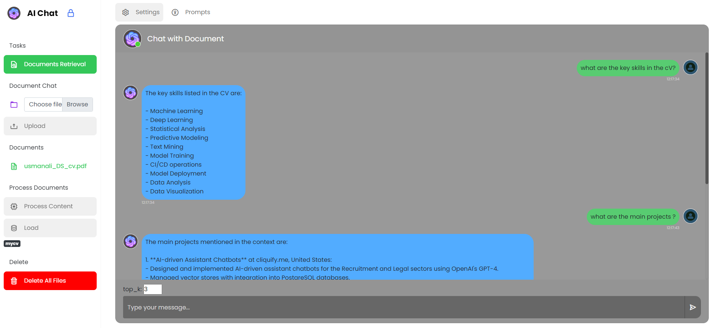

# Chat-with-Documents
Rag based chatbot to chat with your Documents


```markdown
# Chat with Documents

This repository contains the code for a Flask-based application that allows you to chat with documents. Follow the instructions below to set up the environment and run the application.



## Setup Instructions

### 1. Create a Conda Environment

To create a dedicated Conda environment for the project, run the following command:

```bash
conda create -n chat_with_documents python=3.10
```

After the environment is created, activate it with:

```bash
conda activate chat_with_documents
```

### 2. Install Required Packages

Install all necessary Python packages using the `requirements.txt` file:

```bash
pip install -r requirements.txt
```

### 3. Run the Application

To run the Flask application, use the following command:

```bash
python api_app.py
```

The application will run locally, and you can access it at `http://127.0.0.1:5000` in your web browser.

## Demo

Here’s a preview of the application in action:


## Contributing

If you'd like to contribute, please fork the repository and use a feature branch. Pull requests are welcome.

## License

This project is licensed under the MIT License - see the [LICENSE](LICENSE) file for details.
```
